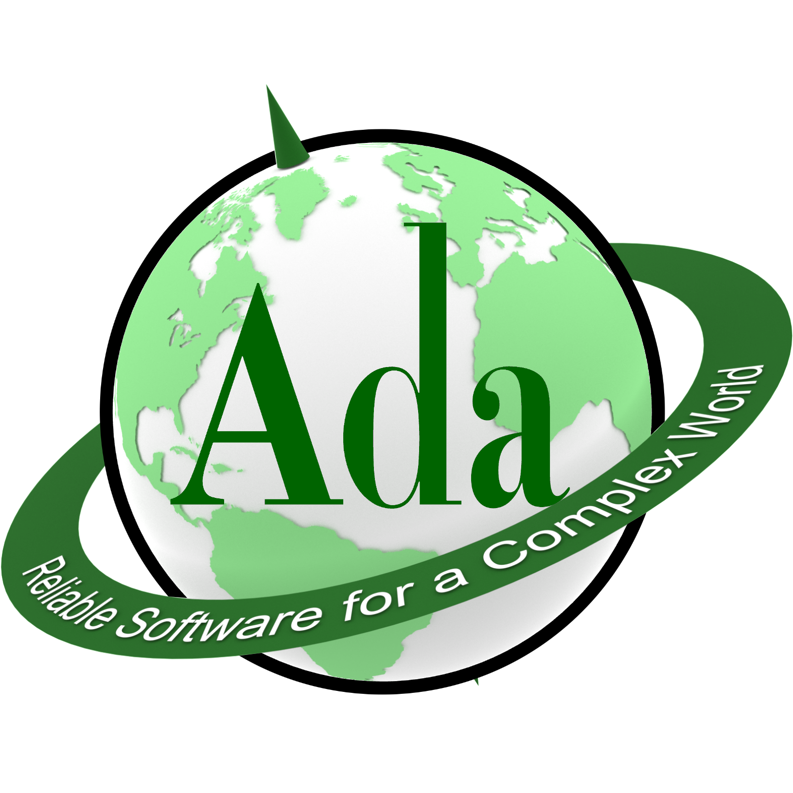

# 280 CONCEPTS OF PROGRAMMING LANGUAGES

**3.0 Units**

CS/IS 280 discusses issues in the design, implementation, and use of high-level programming languages, historical background, and how languages reflect different design philosophies and user requirements. Technical issues in the design of major procedural programming languages and other approaches to programming languages, such as functional programming, logic programming, and object-oriented programming, are studied. Lecture 3 hours.

**Prerequisite:** CS/IS 112 or equivalent.

**Recommended Preparation:** CS/IS 135 or equivalent.

**Course Typically Offered:** Spring (Every Other Year).

**Transfer Credit:** CSU, UC, USC.

---

# 166 ADVANCED COMPUTER ARCHITECTURE AND ASSEMBLY LANGUAGE

**3.0 Units**

CS/IS 166 covers the extension of basic addressing concepts to more advanced addressability such as base register and self-relative addressing, as well as comparative computer architecture focusing on such organizations as multiple register processors and stack machines. Students study the basics of virtual memory input-output and an introduction to the concept of micro programmable systems. Low-level system translation processes associated with assemblers, system functions such as relocatable loading and memory management, applications of data structures, and hashing techniques are covered. Lecture 3 hours.

**Prerequisite:** CS/IS 165 or equivalent.

**Course Typically Offered:** Spring (Every Other Year).

**Transfer Credit:** CSU, UC, USC.
